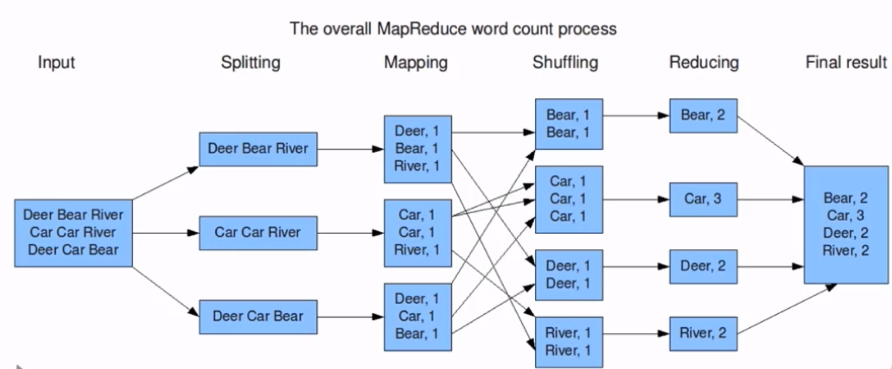
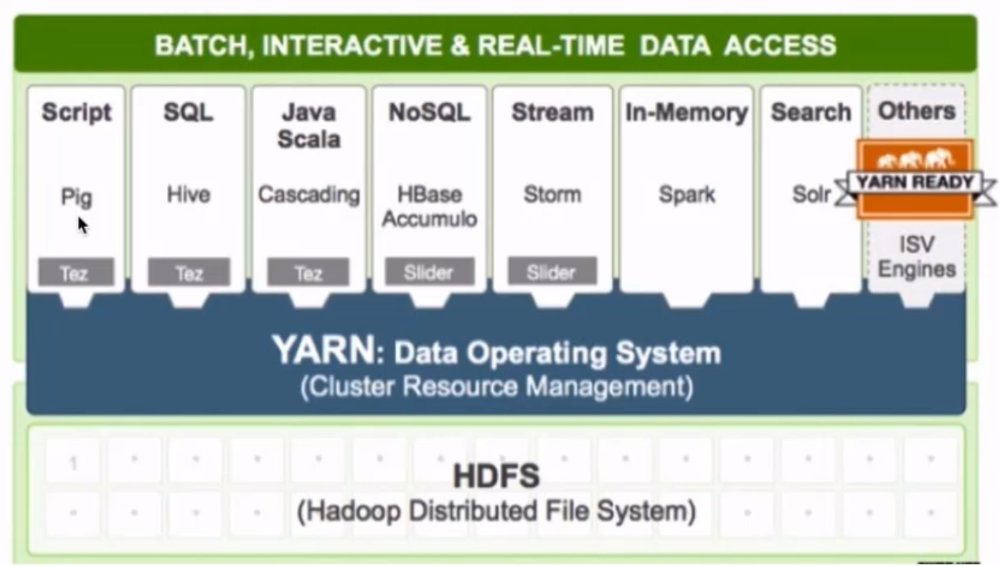

### 1.2 Hadoop核心组件 

- Hadoop是所有搜索引擎的共性问题的廉价解决方案
  - 如何存储持续增长的海量网页:  单节点 V.S. 分布式存储
  - 如何对持续增长的海量网页进行排序: 超算 V.S. 分布式计算
  - HDFS 解决分布式存储问题
  - MapReduce 解决分布式计算问题

- **Hadoop Common**: The common utilities that support the other Hadoop modules.(hadoop的核心组件)
- **Hadoop Distributed File System (HDFS™)**: A distributed file system that provides high-throughput access to application data.(分布式文件系统)
  - 源自于Google的GFS论文, 论文发表于2003年10月
  - HDFS是GFS的开源实现
  - HDFS的特点:扩展性&容错性&海量数量存储
  - 将文件切分成指定大小的数据块, 并在多台机器上保存多个副本
  - 数据切分、多副本、容错等操作对用户是透明的
- 下面这张图是数据块多份复制存储的示意
  - 图中对于文件 /users/sameerp/data/part-0，其复制备份数设置为2, 存储的BlockID分别为1、3。
  - Block1的两个备份存储在DataNode0和DataNode2两个服务器上
  - Block3的两个备份存储在DataNode4和DataNode6两个服务器上

- **Hadoop MapReduce**: A YARN-based system for parallel processing of large data sets.

  - 分布式计算框架
  - 源于Google的MapReduce论文，论文发表于2004年12月
  - MapReduce是GoogleMapReduce的开源实现
  - MapReduce特点:扩展性&容错性&海量数据离线处理

  

- **Hadoop YARN**: A framework for job scheduling and cluster resource management.(资源调度系统)

  - YARN: Yet Another Resource Negotiator

  - 负责整个集群资源的管理和调度

  - YARN特点:扩展性&容错性&多框架资源统一调度

    