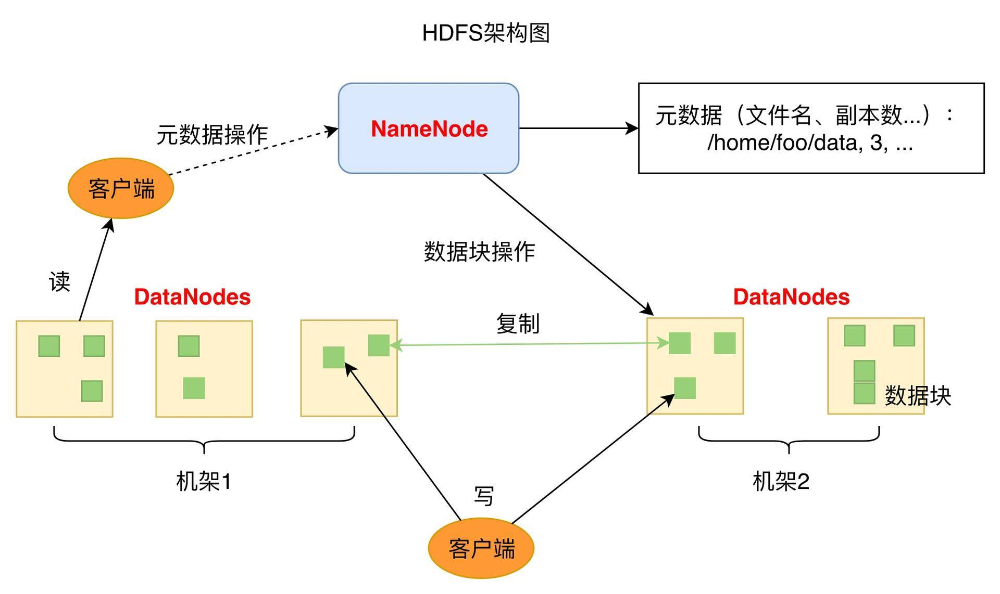

### 2.4 HDFS架构

- 1个NameNode/NN(Master)  带 DataNode/DN(Slaves) (Master-Slave结构)
- 1个文件会被拆分成多个Block
- NameNode(NN)
  - 负责客户端请求的响应
  - 负责元数据（文件的名称、副本系数、Block存放的DN）的管理
    - 元数据 MetaData 描述数据的数据
  - 监控DataNode健康状况 10分钟没有收到DataNode报告认为Datanode死掉了
- DataNode(DN)
  - 存储用户的文件对应的数据块(Block)
  - 要定期向NN发送心跳信息，汇报本身及其所有的block信息，健康状况
- 分布式集群NameNode和DataNode部署在不同机器上

- HDFS优缺点
  - 优点
    - 数据冗余 硬件容错
    - 适合存储大文件
    - 处理流式数据
    - 可构建在廉价机器上
  - 缺点
    - 低延迟的数据访问
    - 小文件存储

