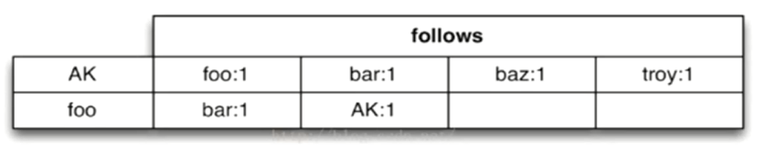

# Hive 

## 一 Hive基本概念

### 1 Hive简介 

```
学习目标
- 了解什么是Hive
- 了解为什么使用Hive
```

####1.1 什么是 Hive   

- Hive 由 Facebook 实现并开源，是基于 Hadoop 的一个数据仓库工具，可以将结构化的数据映射为一张数据库表，并提供 HQL(Hive SQL)查询功能，底层数据是存储在 HDFS 上。
- Hive 本质: 将 SQL 语句转换为 MapReduce 任务运行，使不熟悉 MapReduce 的用户很方便地利用 HQL 处理和计算 HDFS 上的结构化的数据,是一款基于 HDFS 的 MapReduce **计算框架**
- 主要用途：用来做离线数据分析，比直接用 MapReduce 开发效率更高。

#### 1.2 为什么使用 Hive

- 直接使用 Hadoop MapReduce 处理数据所面临的问题：
  - 人员学习成本太高
  - MapReduce 实现复杂查询逻辑开发难度太大

- 使用 Hive
  - 操作接口采用类 SQL 语法，提供快速开发的能力

  - 避免了去写 MapReduce，减少开发人员的学习成本
  - 功能扩展很方便

### 2 Hive 架构

#### 2.1 Hive 架构图


#### 2.2 Hive 组件

- 用户接口：包括 CLI、JDBC/ODBC、WebGUI。
  - CLI(command line interface)为 shell 命令行
  - JDBC/ODBC 是 Hive 的 JAVA 实现，与传统数据库JDBC 类似
  - WebGUI 是通过浏览器访问 Hive。
  - HiveServer2基于Thrift, 允许远程客户端使用多种编程语言如Java、Python向Hive提交请求
- 元数据存储：通常是存储在关系数据库如 mysql/derby 中。
  - Hive 将元数据存储在数据库中。
  - Hive 中的元数据包括
    - 表的名字
    - 表的列
    - 分区及其属性
    - 表的属性（是否为外部表等）
    - 表的数据所在目录等。
- 解释器、编译器、优化器、执行器:完成 HQL 查询语句从词法分析、语法分析、编译、优化以及查询计划的生成。生成的查询计划存储在 HDFS 中，并在随后由 MapReduce 调用执行

#### 2.3 Hive 与 Hadoop 的关系

Hive 利用 HDFS 存储数据，利用 MapReduce 查询分析数据。

Hive是数据仓库工具，没有集群的概念，如果想提交Hive作业只需要在hadoop集群 Master节点上装Hive就可以了

### 3 Hive 与传统数据库对比

- hive 用于海量数据的离线数据分析。

<table>
  <tr>
    <th></th>
    <th>Hive</th>
    <th>关系型数据库</th>
  </tr>
  <tr>
    <td> ANSI SQL </td>
    <td> 不完全支持 </td>
    <td> 支持 </td>
  </tr>
  <tr>
    <td> 更新 </td>
    <td> INSERT OVERWRITE\INTO TABLE(默认) </td>
    <td> UPDATE\INSERT\DELETE </td>
  </tr>
  <tr>
    <td> 事务 </td>
    <td> 不支持(默认) </td>
    <td> 支持 </td>
  </tr>
  <tr>
    <td> 模式 </td>
    <td> 读模式 </td>
    <td> 写模式 </td>
  </tr>
  <tr>
    <td> 查询语言 </td>
    <td> HQL  </td>
    <td> SQL</td>
  </tr>
  <tr>
    <td> 数据存储 </td>
    <td> HDFS </td>
    <td> Raw Device or Local FS </td>
  </tr>
  <tr>
    <td> 执行 </td>
    <td> MapReduce </td>
    <td> Executor</td>
  </tr>
  <tr>
    <td> 执行延迟 </td>
    <td> 高 </td>
    <td> 低 </td>
  </tr>
  <tr>
    <td> 子查询 </td>
    <td> 只能用在From子句中 </td>
    <td> 完全支持 </td>
  </tr>
  <tr>
    <td> 处理数据规模 </td>
    <td> 大 </td>
    <td> 小 </td>
  </tr>
  <tr>
    <td> 可扩展性 </td>
    <td> 高 </td>
    <td> 低 </td>
  </tr>
  <tr>
    <td> 索引 </td>
    <td> 0.8版本后加入位图索引 </td>
    <td> 有复杂的索引 </td>
  </tr>
</table>

- hive支持的数据类型
  - 原子数据类型  
    - TINYINT SMALLINT INT BIGINT BOOLEAN FLOAT DOUBLE STRING BINARY TIMESTAMP DECIMAL CHAR VARCHAR DATE
  - 复杂数据类型
    - ARRAY
    - MAP
    - STRUCT
- hive中表的类型
  - 托管表 (managed table) (内部表)
  - 外部表

### 4 Hive 数据模型

- Hive 中所有的数据都存储在 HDFS 中，没有专门的数据存储格式
- 在创建表时指定数据中的分隔符，Hive 就可以映射成功，解析数据。
- Hive 中包含以下数据模型：
  - db：在 hdfs 中表现为 hive.metastore.warehouse.dir 目录下一个文件夹
  - table：在 hdfs 中表现所属 db 目录下一个文件夹
  - external table：数据存放位置可以在 HDFS 任意指定路径
  - partition：在 hdfs 中表现为 table 目录下的子目录
  - bucket：在 hdfs 中表现为同一个表目录下根据 hash 散列之后的多个文件

### 5 Hive 安装部署
- Hive 安装前需要安装好 JDK 和 Hadoop。配置好环境变量。

- 下载Hive的安装包 http://archive.cloudera.com/cdh5/cdh/5/ 并解压

  ```shell
   tar -zxvf hive-1.1.0-cdh5.7.0.tar.gz  -C ~/app/
  ```

- 进入到 解压后的hive目录 找到 conf目录, 修改配置文件

  ```shell
  cp hive-env.sh.template hive-env.sh
  vi hive-env.sh
  ```

  在hive-env.sh中指定hadoop的路径

  ```shell
  HADOOP_HOME=/home/hadoop/app/hadoop-2.6.0-cdh5.7.0
  ```

- 配置环境变量

  - ```shell
    vi ~/.bash_profile
    ```

  - ```shell
    export HIVE_HOME=/home/hadoop/app/hive-1.1.0-cdh5.7.0
    export PATH=$HIVE_HOME/bin:$PATH
    ```

  - ```shell
    source ~/.bash_profile
    ```

- 根据元数据存储的介质不同，分为下面两个版本，其中 derby 属于内嵌模式。实际生产环境中则使用 mysql 来进行元数据的存储。

  - 内置 derby 版： 
    bin/hive 启动即可使用
    缺点：不同路径启动 hive，每一个 hive 拥有一套自己的元数据，无法共享

  - mysql 版： 

    - 上传 mysql驱动到 hive安装目录的lib目录下

      mysql-connector-java-5.*.jar

    - vi conf/hive-site.xml 配置 Mysql 元数据库信息(MySql安装见文档)

      ```xml-dtd
      <?xml version="1.0" encoding="UTF-8" standalone="no"?>
      <?xml-stylesheet type="text/xsl" href="configuration.xsl"?>
      <configuration>
      <!-- 插入以下代码 -->
          <property>
              <name>javax.jdo.option.ConnectionUserName</name>
              <value>hive</value><!-- 指定mysql用户名 -->
          </property>
          <property>
              <name>javax.jdo.option.ConnectionPassword</name>
              <value>hive</value><!-- 指定mysql密码 -->
          </property>
         <property>
              <name>javax.jdo.option.ConnectionURL</name>mysql
              <value>jdbc:mysql://127.0.0.1:3306/hive</value>
          </property><!-- 指定mysql数据库地址 -->
          <property>
              <name>javax.jdo.option.ConnectionDriverName</name>
              <value>com.mysql.jdbc.Driver</value><!-- 指定mysql驱动 -->
          </property>
              <!-- 到此结束代码 -->
        <property>
          <name>hive.exec.script.wrapper</name>
          <value/>
          <description/>
        </property>
      </configuration>
      
      ```

- hive启动

  - 启动docker 

    ```service docker start```

  - 通过docker 启动mysql

    ```docker start mysql```

  - 启动 hive的metastore元数据服务

    ```hive --service metastore```

  - 启动hive

    ```hive```

  - MySQL root 密码 password         hive用户 密码 hive

## 二 Hive 基本操作

### 2.1 Hive HQL操作初体验

- 创建数据库

  ``` sql
  CREATE DATABASE test;
  ```

- 显示所有数据库

   ``` sql
   SHOW DATABASES;
   ```

- 创建表

   ```sql
   CREATE TABLE student(classNo string, stuNo string, score int) row format delimited fields terminated by ',';
   ```

   - row format delimited fields terminated by ','  指定了字段的分隔符为逗号，所以load数据的时候，load的文本也要为逗号，否则加载后为NULL。hive只支持单个字符的分隔符，hive默认的分隔符是\001

- 将数据load到表中

   - 在本地文件系统创建一个如下的文本文件：/home/hadoop/tmp/student.txt

      ```
      C01,N0101,82
      C01,N0102,59
      C01,N0103,65
      C02,N0201,81
      C02,N0202,82
      C02,N0203,79
      C03,N0301,56
      C03,N0302,92
      C03,N0306,72
      ```

   - ``` sql
      load data local inpath '/home/hadoop/tmp/student.txt'overwrite into table student;
      ```

   - 这个命令将student.txt文件复制到hive的warehouse目录中，这个目录由hive.metastore.warehouse.dir配置项设置，默认值为/user/hive/warehouse。Overwrite选项将导致Hive事先删除student目录下所有的文件, 并将文件内容映射到表中。
      Hive不会对student.txt做任何格式处理，因为Hive本身并不强调数据的存储格式。

- 查询表中的数据 跟SQL类似

   ``` sql
   hive>select * from student;
   ```

- 分组查询group by和统计 count

  ```sql
  hive>select classNo,count(score) from student where score>=60 group by classNo;
  ```

  从执行结果可以看出 hive把查询的结果变成了MapReduce作业通过hadoop执行

### 2.2 Hive的内部表和外部表

<table>
  <tr>
    <th></th>
    <th>内部表(managed table)</th>
    <th>外部表(external table)</th>
  </tr>
  <tr>
    <td> 概念 </td>
    <td> 创建表时无external修饰 </td>
    <td> 创建表时被external修饰 </td>
  </tr>
  <tr>
    <td> 数据管理 </td>
    <td> 由Hive自身管理 </td>
    <td> 由HDFS管理 </td>
  </tr>
  <tr>
    <td> 数据保存位置 </td>
    <td> hive.metastore.warehouse.dir  （默认：/user/hive/warehouse） </td>
    <td> hdfs中任意位置 </td>
  </tr>
  <tr>
    <td> 删除时影响 </td>
    <td> 直接删除元数据（metadata）及存储数据 </td>
    <td> 仅会删除元数据，HDFS上的文件并不会被删除 </td>
  </tr>
  <tr>
    <td> 表结构修改时影响 </td>
    <td> 修改会将修改直接同步给元数据  </td>
    <td> 表结构和分区进行修改，则需要修复（MSCK REPAIR TABLE table_name;）</td>
  </tr>
</table>

- 案例

  - 创建一个外部表student2

  ```sql
  CREATE EXTERNAL TABLE student2 (classNo string, stuNo string, score int) row format delimited fields terminated by ',' location '/tmp/student';
  ```

  - 装载数据

       ```sql
       load data local inpath '/home/hadoop/tmp/student.txt' overwrite into table student2;
       ```

- 显示表信息

  ``` sql
  desc formatted table_name;
  ```

- 删除表查看结果

  ```sql
  drop table student;
  ```

- 再次创建外部表 student2

- 不插入数据直接查询查看结果

  ```sql
  select * from student2;
  ```

### 2.3 分区表

- 什么是分区表

  - 随着表的不断增大，对于新纪录的增加，查找，删除等(DML)的维护也更加困难。对于数据库中的超大型表，可以通过把它的数据分成若干个小表，从而简化数据库的管理活动，对于每一个简化后的小表，我们称为一个单个的分区。
  - hive中分区表实际就是对应hdfs文件系统上独立的文件夹，该文件夹内的文件是该分区所有数据文件。
  - 分区可以理解为分类，通过分类把不同类型的数据放到不同的目录下。
  - 分类的标准就是分区字段，可以一个，也可以多个。
  - 分区表的意义在于优化查询。查询时尽量利用分区字段。如果不使用分区字段，就会全部扫描。

- 创建分区表

  ``` shell
  tom,4300
  jerry,12000
  mike,13000
  jake,11000
  rob,10000
  ```

  

  ```sql
  create table employee (name string,salary bigint) partitioned by (date1 string) row format delimited fields terminated by ',' lines terminated by '\n' stored as textfile;
  ```

- 查看表的分区

  ```sql
  show partitions employee;
  ```

- 添加分区

  ```
  alter table employee add if not exists partition(date1='2018-12-01');
  ```

- 加载数据到分区

  ```
  load data local inpath '/home/hadoop/tmp/employee.txt' into table employee partition(date1='2018-12-01');
  ```

- 如果重复加载同名文件，不会报错，会自动创建一个*_copy_1.txt

- 外部分区表即使有分区的目录结构, 也必须要通过hql添加分区, 才能看到相应的数据

  ``` shell
  hadoop fs -mkdir /user/hive/warehouse/emp/dt=2018-12-04
  hadoop fs -copyFromLocal /tmp/employee.txt /user/hive/warehouse/test.db/emp/dt=2018-12-04/employee.txt
  ```

  - 此时查看表中数据发现数据并没有变化, 需要通过hql添加分区

    ```
    alter table emp add if not exists partition(dt='2018-12-04');
    ```

  - 此时再次查看才能看到新加入的数据

- 总结
  - 利用分区表方式减少查询时需要扫描的数据量
    - 分区字段不是表中的列, 数据文件中没有对应的列
    - 分区仅仅是一个目录名
    - 查看数据时, hive会自动添加分区列
    - 支持多级分区, 多级子目录

### 2.4 动态分区

- 在写入数据时自动创建分区(包括目录结构)

- 创建表

  ```
  create table employee2 (name string,salary bigint) partitioned by (date1 string) row format delimited fields terminated by ',' lines terminated by '\n' stored as textfile;
  ```

- 导入数据

  ```sql
  insert into table employee2 partition(date1) select name,salary,date1 from employee;
  ```

- 使用动态分区需要设置参数

  ```shell
  set hive.exec.dynamic.partition.mode=nonstrict;
  ```


## 三 Hive 函数

### 3.1 内置运算符

在 Hive 有四种类型的运算符：

- 关系运算符

- 算术运算符

- 逻辑运算符

- 复杂运算

  (内容较多，见《Hive 官方文档》》)


### 3.2 内置函数
https://cwiki.apache.org/confluence/display/Hive/LanguageManual+UDF

- 简单函数: 日期函数 字符串函数 类型转换 
- 统计函数: sum avg distinct
- 集合函数
- 分析函数
- show functions;  显示所有函数
- desc function 函数名;
- desc function extended 函数名;

### 3.3 Hive 自定义函数和 Transform

- UDF
  - 当 Hive 提供的内置函数无法满足你的业务处理需要时，此时就可以考虑使用用户自定义函数（UDF：user-defined function）。

  - **TRANSFORM**,and **UDF** and **UDAF**

    it is possible to plug in your own custom mappers and reducers

     A UDF is basically only a transformation done by a mapper meaning that each row should be mapped to exactly one row. A UDAF on the other hand allows us to transform a group of rows into one or more rows, meaning that we can reduce the number of input rows to a single output row by some custom aggregation.

    **UDF**：就是做一个mapper，对每一条输入数据，映射为一条输出数据。

    **UDAF**:就是一个reducer，把一组输入数据映射为一条(或多条)输出数据。

    一个脚本至于是做mapper还是做reducer，又或者是做udf还是做udaf，取决于我们把它放在什么样的hive操作符中。放在select中的基本就是udf，放在distribute by和cluster by中的就是reducer。

    We can control if the script is run in a mapper or reducer step by the way we formulate our HiveQL query.

    The statements DISTRIBUTE BY and CLUSTER BY allow us to indicate that we want to actually perform an aggregation.

    User-Defined Functions (UDFs) for transformations and even aggregations which are therefore called User-Defined Aggregation Functions (UDAFs)

- UDF示例(运行java已经编写好的UDF)

  - 在hdfs中创建 /user/hive/lib目录

    ``` shell
    hadoop fs -mkdir /user/hive/lib
    ```

  - 把 hive目录下 lib/hive-contrib-hive-contrib-1.1.0-cdh5.7.0.jar 放到hdfs中

    ```shell
    hadoop fs -put hive-contrib-1.1.0-cdh5.7.0.jar /user/hive/lib/
    ```

  - 把集群中jar包的位置添加到hive中

    ```shell
    hive> add jar hdfs:///user/hive/lib/hive-contrib-1.1.0-cdh5.7.0.jar;
    ```

  - 在hive中创建**临时**UDF

    ```sql
    hive> CREATE TEMPORARY FUNCTION row_sequence as 'org.apache.hadoop.hive.contrib.udf.UDFRowSequence'
    ```

  - 在之前的案例中使用**临时**自定义函数(函数功能: 添加自增长的行号)

    ```sql
    Select row_sequence(),* from employee;
    ```

  - 创建**非临时**自定义函数

    ```
    CREATE FUNCTION row_sequence as 'org.apache.hadoop.hive.contrib.udf.UDFRowSequence' using jar 'hdfs:///user/hive/lib/hive-contrib-1.1.0-cdh5.7.0.jar';
    ```

- Python UDF

  - 准备案例环境

    - 创建表

      ```sql
      CREATE table u(fname STRING,lname STRING);
      ```

    - 向表中插入数据

      ```sql
      insert into table u2 values('George','washington');
      insert into table u2 values('George','bush');
      insert into table u2 values('Bill','clinton');
      insert into table u2 values('Bill','gates');
      ```

  - 编写map风格脚本

    ```python
    import sys
    for line in sys.stdin:
        line = line.strip()
        fname , lname = line.split('\t')
        l_name = lname.upper()
        print '\t'.join([fname, str(l_name)])
    ```

  - 通过hdfs向hive中ADD file

    - 加载文件到hdfs

      ```shell
      hadoop fs -put udf.py /user/hive/lib/
      ```

    - hive从hdfs中加载python脚本

      ```shell
      ADD FILE hdfs:///user/hive/lib/udf.py;
      ADD FILE /root/tmp/udf1.py;
      ```

  - Transform

    ``` sql
    SELECT TRANSFORM(fname, lname) USING 'python udf1.py' AS (fname, l_name) FROM u;
    ```


- Python UDAF


## 四 hive综合案例

- 内容推荐数据处理

  

  - 需求
    - 根据用户行为以及文章标签筛选出用户最感兴趣(阅读最多)的标签

- 相关数据

  ​    user_id article_id event_time

  ```
  11,101,2018-12-01 06:01:10
  22,102,2018-12-01 07:28:12
  33,103,2018-12-01 07:50:14
  11,104,2018-12-01 09:08:12
  22,103,2018-12-01 13:37:12
  33,102,2018-12-02 07:09:12
  11,101,2018-12-02 18:42:12
  35,105,2018-12-03 09:21:12
  22,104,2018-12-03 16:42:12
  77,103,2018-12-03 18:31:12
  99,102,2018-12-04 00:04:12
  33,101,2018-12-04 19:10:12
  11,101,2018-12-05 09:07:12
  35,102,2018-12-05 11:00:12
  22,103,2018-12-05 12:11:12
  77,104,2018-12-05 18:02:02
  99,105,2018-12-05 20:09:11
  
  ```

  - 文章数据

  ```
  artical_id,artical_url,artical_keywords
  101,http://www.itcast.cn/1.html,kw8|kw1
  102,http://www.itcast.cn/2.html,kw6|kw3
  103,http://www.itcast.cn/3.html,kw7
  104,http://www.itcast.cn/4.html,kw5|kw1|kw4|kw9
  105,http://www.itcast.cn/5.html,
  ```

- 数据上传hdfs

  ```shell
  hadoop fs -mkdir /tmp/demo
  hadoop fs -mkdir /tmp/demo/user_action
  ```

- 创建外部表

  - 用户行为表

  ```sql
  drop table if exists user_actions;
  CREATE EXTERNAL TABLE user_actions(
      user_id STRING,
      article_id STRING,
      time_stamp STRING
  )
  ROW FORMAT delimited fields terminated by ','
  LOCATION '/tmp/demo/user_action';
  ```
  - 文章表

  ```sql
  drop table if exists articles;
  CREATE EXTERNAL TABLE articles(
      article_id STRING,
      url STRING,
      key_words array<STRING>
  )
  ROW FORMAT delimited fields terminated by ',' 
  COLLECTION ITEMS terminated BY '|' 
  LOCATION '/tmp/demo/article_keywords';
  /*
  key_words array<STRING>  数组的数据类型
  COLLECTION ITEMS terminated BY '|'  数组的元素之间用'|'分割
  */
  ```

  - 查看数据

  ```sql
  select * from user_actions;
  select * from articles;
  ```

  - 分组查询每个用户的浏览记录

    - collect_set/collect_list作用:
      - 将group by中的某列转为一个数组返回
      - collect_list**不去重**而collect_set**去重**
    - collect_set

    ```sql
    select user_id,collect_set(article_id) 
    from user_actions group by user_id;
    ```

    ```shell
    11      ["101","104"]
    22      ["102","103","104"]
    33      ["103","102","101"]
    35      ["105","102"]
    77      ["103","104"]
    99      ["102","105"]
    ```

    - collect_list

    ``` sql
    select user_id,collect_list(article_id) 
    from user_actions group by user_id;
    ```

    ``` shell
    
    11      ["101","104","101","101"]
    22      ["102","103","104","103"]
    33      ["103","102","101"]
    35      ["105","102"]
    77      ["103","104"]
    99      ["102","105"]
    
    ```

    - sort_array: 对数组排序

    ``` sql
    select user_id,sort_array(collect_list(article_id)) as contents 
    from user_actions group by user_id;
    ```

    ``` shell
    11      ["101","101","101","104"]
    22      ["102","103","103","104"]
    33      ["101","102","103"]
    35      ["102","105"]
    77      ["103","104"]
    99      ["102","105"]
    ```

  - 查看每一篇文章的关键字 lateral view explode

      - explode函数 将array 拆分

    ```sql
    select explode(key_words) from articles;
    ```

    - lateral view 和 explode 配合使用,将一行数据拆分成多行数据，在此基础上可以对拆分的数据进行聚合

    ``` sql
    select article_id,kw from articles lateral view explode(key_words) t as kw;
    ```

    ```shell
    101     kw8
    101     kw1
    102     kw6
    102     kw3
    103     kw7
    104     kw5
    104     kw1
    104     kw4
    104     kw9
    ```

    ```sql
    select article_id,kw from articles lateral view outer explode(key_words) t as kw;
    ```

    ``` shell
    101     kw8
    101     kw1
    102     kw6
    102     kw3
    103     kw7
    104     kw5
    104     kw1
    104     kw4
    104     kw9
    105     NULL
    #含有outer
    ```

    

  - 根据文章id找到用户查看文章的关键字

    - 原始数据

    ```shell
    101     http://www.itcast.cn/1.html     ["kw8","kw1"]
    102     http://www.itcast.cn/2.html     ["kw6","kw3"]
    103     http://www.itcast.cn/3.html     ["kw7"]
    104     http://www.itcast.cn/4.html     ["kw5","kw1","kw4","kw9"]
    105     http://www.itcast.cn/5.html     []
    ```

    ```sql
    select a.user_id, b.kw from user_actions 
    as a left outer JOIN (select article_id,kw from articles
    lateral view outer explode(key_words) t as kw) b
    on (a.article_id = b.article_id)
    order by a.user_id;
    ```

    ```shell
    11      kw1
    11      kw8
    11      kw5
    11      kw1
    11      kw4
    11      kw1
    11      kw9
    11      kw8
    11      kw1
    11      kw8
    22      kw1
    22      kw7
    22      kw9
    22      kw4
    22      kw5
    22      kw7
    22      kw3
    22      kw6
    33      kw8
    33      kw1
    33      kw3
    33      kw6
    33      kw7
    35      NULL
    35      kw6
    35      kw3
    77      kw9
    77      kw1
    77      kw7
    77      kw4
    77      kw5
    99      kw3
    99      kw6
    99      NULL
    ```

  - 根据文章id找到用户查看文章的关键字并统计频率

    ```sql
    select a.user_id, b.kw,count(1) as weight 
    from user_actions as a 
    left outer JOIN (select article_id,kw from articles
    lateral view outer explode(key_words) t as kw) b
    on (a.article_id = b.article_id)
    group by a.user_id,b.kw 
    order by a.user_id,weight desc;
    ```

    ```shell
    11      kw1     4
    11      kw8     3
    11      kw5     1
    11      kw9     1
    11      kw4     1
    22      kw7     2
    22      kw9     1
    22      kw1     1
    22      kw3     1
    22      kw4     1
    22      kw5     1
    22      kw6     1
    33      kw3     1
    33      kw8     1
    33      kw7     1
    33      kw6     1
    33      kw1     1
    35      NULL    1
    35      kw3     1
    35      kw6     1
    77      kw1     1
    77      kw4     1
    77      kw5     1
    77      kw7     1
    77      kw9     1
    99      NULL    1
    99      kw3     1
    99      kw6     1
    ```

  - CONCAT：
    CONCAT(str1,str2,…)  

    返回结果为连接参数产生的字符串。如有任何一个参数为NULL ，则返回值为 NULL。

    ``` sql
    select concat(user_id,article_id) from user_actions;
    ```

    CONCAT_WS:

    使用语法为：CONCAT_WS(separator,str1,str2,…)

    CONCAT_WS() 代表 CONCAT With Separator ，是CONCAT()的特殊形式。第一个参数是其它参数的分隔符。分隔符的位置放在要连接的两个字符串之间。分隔符可以是一个字符串，也可以是其它参数。如果分隔符为 NULL，则结果为 NULL。

    ```sql
    select concat_ws(':',user_id,article_id) from user_actions;
    ```

  - 将用户查看的关键字和频率合并成 key:value形式

    ```sql
    select a.user_id, concat_ws(':',b.kw,cast (count(1) as string)) as kw_w 
    from user_actions as a 
    left outer JOIN (select article_id,kw from articles
    lateral view outer explode(key_words) t as kw) b
    on (a.article_id = b.article_id)
    group by a.user_id,b.kw;
    ```

    ```shell
    11      kw1:4
    11      kw4:1
    11      kw5:1
    11      kw8:3
    11      kw9:1
    22      kw1:1
    22      kw3:1
    22      kw4:1
    22      kw5:1
    22      kw6:1
    22      kw7:2
    22      kw9:1
    33      kw1:1
    33      kw3:1
    33      kw6:1
    33      kw7:1
    33      kw8:1
    35      1
    35      kw3:1
    35      kw6:1
    77      kw1:1
    77      kw4:1
    77      kw5:1
    77      kw7:1
    77      kw9:1
    99      1
    99      kw3:1
    99      kw6:1
    ```

  - 将用户查看的关键字和频率合并成 key:value形式并按用户聚合

    ```sql
    select cc.user_id,concat_ws(',',collect_set(cc.kw_w))
    from(
    select a.user_id, concat_ws(':',b.kw,cast (count(1) as string)) as kw_w 
    from user_actions as a 
    left outer JOIN (select article_id,kw from articles
    lateral view outer explode(key_words) t as kw) b
    on (a.article_id = b.article_id)
    group by a.user_id,b.kw
    ) as cc 
    group by cc.user_id;
    ```

    ```shell
    11      kw1:4,kw4:1,kw5:1,kw8:3,kw9:1
    22      kw1:1,kw3:1,kw4:1,kw5:1,kw6:1,kw7:2,kw9:1
    33      kw1:1,kw3:1,kw6:1,kw7:1,kw8:1
    35      1,kw3:1,kw6:1
    77      kw1:1,kw4:1,kw5:1,kw7:1,kw9:1
    99      1,kw3:1,kw6:1
    ```

  - 将上面聚合结果转换成map

    ```sql
    select cc.user_id,str_to_map(concat_ws(',',collect_set(cc.kw_w))) as wm
    from(
    select a.user_id, concat_ws(':',b.kw,cast (count(1) as string)) as kw_w 
    from user_actions as a 
    left outer JOIN (select article_id,kw from articles
    lateral view outer explode(key_words) t as kw) b
    on (a.article_id = b.article_id)
    group by a.user_id,b.kw
    ) as cc 
    group by cc.user_id;
    ```

    ```shell
    11      {"kw1":"4","kw4":"1","kw5":"1","kw8":"3","kw9":"1"}
    22      {"kw1":"1","kw3":"1","kw4":"1","kw5":"1","kw6":"1","kw7":"2","kw9":"1"}
    33      {"kw1":"1","kw3":"1","kw6":"1","kw7":"1","kw8":"1"}
    35      {"1":null,"kw3":"1","kw6":"1"}
    77      {"kw1":"1","kw4":"1","kw5":"1","kw7":"1","kw9":"1"}
    99      {"1":null,"kw3":"1","kw6":"1"}
    ```

  - 将用户的阅读偏好结果保存到表中

    ```sql
    create table user_kws as 
    select cc.user_id,str_to_map(concat_ws(',',collect_set(cc.kw_w))) as wm
    from(
    select a.user_id, concat_ws(':',b.kw,cast (count(1) as string)) as kw_w 
    from user_actions as a 
    left outer JOIN (select article_id,kw from articles
    lateral view outer explode(key_words) t as kw) b
    on (a.article_id = b.article_id)
    group by a.user_id,b.kw
    ) as cc 
    group by cc.user_id;
    ```

  - 从表中通过key查询map中的值

    ```sql
    select user_id, wm['kw1'] from user_kws;
    ```

    ```shell
    11      4
    22      1
    33      1
    35      NULL
    77      1
    99      NULL
    ```

  - 从表中获取map中所有的key 和 所有的value

    ```sql
    select user_id,map_keys(wm),map_values(wm) from user_kws;
    ```

    ```shell
    11      ["kw1","kw4","kw5","kw8","kw9"] ["4","1","1","3","1"]
    22      ["kw1","kw3","kw4","kw5","kw6","kw7","kw9"]     ["1","1","1","1","1","2","1"]
    33      ["kw1","kw3","kw6","kw7","kw8"] ["1","1","1","1","1"]
    35      ["1","kw3","kw6"]       [null,"1","1"]
    77      ["kw1","kw4","kw5","kw7","kw9"] ["1","1","1","1","1"]
    99      ["1","kw3","kw6"]       [null,"1","1"]
    ```

  - 用lateral view explode把map中的数据转换成多列

    ```sql
    select user_id,keyword,weight from user_kws lateral view explode(wm) t as keyword,weight;
    ```

    ```shell
    11      kw1     4
    11      kw4     1
    11      kw5     1
    11      kw8     3
    11      kw9     1
    22      kw1     1
    22      kw3     1
    22      kw4     1
    22      kw5     1
    22      kw6     1
    22      kw7     2
    22      kw9     1
    33      kw1     1
    33      kw3     1
    33      kw6     1
    33      kw7     1
    33      kw8     1
    35      1       NULL
    35      kw3     1
    35      kw6     1
    77      kw1     1
    77      kw4     1
    77      kw5     1
    77      kw7     1
    77      kw9     1
    99      1       NULL
    99      kw3     1
    99      kw6     1
    ```


## 五 HBase简介与环境部署

### 5.1 HBase简介&在Hadoop生态中的地位

#### 5.1.1 什么是HBase

- HBase是一个分布式的、面向列的开源数据库
- HBase是Google BigTable的开源实现
- HBase不同于一般的关系数据库, 适合非结构化数据存储

#### 5.1.2 BigTable

- BigTable是Google设计的分布式数据存储系统，用来处理海量的数据的一种非关系型的数据库。
  - 适合大规模海量数据，PB级数据；
  - 分布式、并发数据处理，效率极高；
  - 易于扩展，支持动态伸缩
  - 适用于廉价设备；
  - 不适用于传统关系型数据的存储；

#### 5.1.3 面向列的数据库

**HBase 与 传统关系数据库的区别**

<table>
  <tr>
    <th></th>
    <th>HBase</th>
    <th>关系型数据库</th>
  </tr>
  <tr>
    <td> 数据库大小 </td>
    <td> PB级别  </td>
    <td>GB TB</td>
  </tr>
  <tr>
    <td> 数据类型 </td>
    <td> Bytes </td>
    <td> 丰富的数据类型 </td>
  </tr>
    <tr>
    <td> 事务支持 </td>
    <td> ACID只支持单个Row级别 </td>
    <td> 全面的ACID支持, 对Row和表</td>
  </tr>
  <tr>
    <td> 索引 </td>
    <td> 只支持Row-key </td>
    <td> 支持 </td>
  </tr>
    <tr>
    <td> 吞吐量 </td>
    <td> 百万写入/秒 </td>
    <td> 数千写入/秒</td>
  </tr>
</table>

- 关系型数据库中数据示例

<table>
  <tr>
    <th>ID</th>
    <th>FILE NAME</th>
    <th>FILE PATH</th>
    <th>FILE TYPE</th>
    <th>FILE SIZE</th>
    <th>CREATOR</th>
  </tr>
  <tr>
    <td> 1 </td>
    <td> file1.txt  </td>
    <td>/home</td>
    <td> txt </td>
    <td> 1024 </td>
    <td> tom </td>
  </tr>
  <tr>
    <td> 2 </td>
    <td> file2.txt  </td>
    <td>/home/pics</td>
    <td> jpg </td>
    <td> 5032 </td>
    <td> jerry </td>
  </tr>
</table>

- 同样数据保存到列式数据库中

<table>
<tr>
<th>RowKey</th>
<th>FILE INFO</th>
<th>SAVE INFO</th>
</tr>
<tr>
<td> 1 </td>
<td> name:file1.txt
type:txt
size:1024</td>
<td>path:/home/pics
creator:Jerry
</td>
</tr>
<tr>
<td> 2 </td>
<td>name:file2.jpg
type:jpg
size:5032</td>
<td> path:/home
creator:Tom</td>
</tr>
</table>


- 行数据库&列数据库存储方式比较


#### 5.1.4 什么是非结构化数据存储

- 结构化数据
  - 适合用二维表来展示的数据
- 非结构化数据
  - 非结构化数据是数据结构不规则或不完整
  - 没有预定义的数据模型
  - 不方便用数据库二维逻辑表来表现
  - 办公文档、文本、图片、XML, HTML、各类报表、图像和音频/视频信息等

#### 5.1.5 HBase在Hadoop生态中的地位

- HBase是Apache基金会顶级项目

- HBase基于HDFS进行数据存储

- HBase可以存储超大数据并适合用来进行大数据的实时查询

  

#### 5.1.6 HBase与HDFS

- HBase建立在Hadoop文件系统上, 利用了HDFS的容错能力
- HBase提供对数据的随机实时读/写访问功能
- HBase内部使用哈希表, 并存储索引, 可以快速查找HDFS中数据

#### 5.1.7 HBase使用场景

- 瞬间写入量很大
- 大量数据需要长期保存, 且数量会持续增长
- HBase不适合有join, 多级索引, 表关系复杂的数据模型

##六 HBase的数据模型

- NameSpace: 关系型数据库的"数据库"(database)
- 表(table)：用于存储管理数据，具有稀疏的、面向列的特点。HBase中的每一张表，就是所谓的大表(Bigtable)，可以有上亿行，上百万列。对于为值为空的列，并不占用存储空间，因此表可以设计的非常稀疏。
- 行(Row)：在表里面,每一行代表着一个数据对象,每一行都是以一个行键(Row Key)来进行唯一标识的, 行键并没有什么特定的数据类型, 以二进制的字节来存储
- 列(Column): HBase的列由 Column family 和 Column qualifier 组成, 由冒号: 进行行间隔, 如 family: qualifier
- 行键(RowKey)：类似于MySQL中的主键，HBase根据行键来快速检索数据，一个行键对应一条记录。与MySQL主键不同的是，HBase的行键是天然固有的，每一行数据都存在行键。
- 列族(ColumnFamily)：是列的集合。列族在表定义时需要指定，而列在插入数据时动态指定。列中的数据都是以二进制形式存在，没有数据类型。在物理存储结构上，每个表中的每个列族单独以一个文件存储。一个表可以有多个列簇。
- 列修饰符(*Column* *Qualifier*) : 列族中的数据通过列标识来进行映射, 可以理解为一个键值对(key-value), 列修饰符(*Column* *Qualifier*) 就是key 对应关系型数据库的列
- 时间戳(TimeStamp)：是列的一个属性，是一个64位整数。由行键和列确定的单元格，可以存储多个数据，每个数据含有时间戳属性，数据具有版本特性。可根据版本(VERSIONS)或时间戳来指定查询历史版本数据，如果都不指定，则默认返回最新版本的数据。
- 区域(Region)：HBase自动把表水平划分成的多个区域，划分的区域随着数据的增大而增多。

- HBase 支持特定场景下的 ACID，即对行级别的 操作保证完全的 ACID

- #### cap定理

  - 分布式系统的最大难点，就是各个节点的状态如何同步。CAP 定理是这方面的基本定理，也是理解分布式系统的起点。

    - 一致性(所有节点在同一时间具有相同的数据)

      

    - 可用性(保证每个请求不管成功或失败都有响应,但不保证获取的数据的正确性)

    - 分区容错性(系统中任意信息的丢失或失败不会影响系统的运行,系统如果不能在某个时限内达成数据一致性,就必须在上面两个操作之间做出选择)

    

    **hbase是CAP中的CP系统,即hbase是强一致性的**

## 七 HBase 的安装与实战

### 7.1 HBase的安装

- 下载安装包 http://archive.cloudera.com/cdh5/cdh/5/hbase-1.2.0-cdh5.7.0.tar.gz

- 配置伪分布式环境

  - 环境变量配置

    ```shell
    export HBASE_HOME=/usr/local/development/hbase-1.2.4
    export PATH=$HBASE_HOME/bin:$PATH
    ```

  - 配置hbase-env.sh

    ```shell
    export JAVA_HOME=/usr/local/development/jdk1.7.0_15
    export HBASE_MANAGES_ZK=false  --如果你是使用hbase自带的zk就是true，如果使用自己的zk就是false
    ```

  - 配置hbase-site.xml

    ```xml
    <property>
          <name>hbase.rootdir</name>　　--hbase持久保存的目录
          <value>hdfs://hadoop001:8020/opt/hbase</value>   
    </property>
    <property>
          <name>hbase.cluster.distributed</name>  --是否是分布式
          <value>true</value>
    </property>
    <property>     
              <name>hbase.zookeeper.property.clientPort</name>    --指定要连接zk的端口
              <value>2181</value>    
    </property>    
    <property>        
              <name>hbase.zookeeper.property.dataDir</name>            <value>/home/hadoop/app/hbase/zkData</value>    
    </property>          
    ```

  - 启动hbase（启动的hbase的时候要保证hadoop集群已经启动）

    ```shell
    /hbase/bin/start-hbase.sh
    ```

  - 输入hbase shell（进入shell命令行）

### 7.2 HBase shell

- HBase DDL 和 DML 命令

<table>
  <tr>
    <th>名称</th>
    <th>命令表达式</th>
  </tr>
  <tr>
    <td> 创建表 </td>
   <td> create '表名', '列族名1','列族名2','列族名n' </td>
  </tr>
  <tr>
    <td> 添加记录 </td>
    <td> put '表名','行名','列名:','值 </td>
  </tr>
    <tr>
    <td> 查看记录 </td>
    <td> get '表名','行名' </td>
  </tr>
  <tr>
    <td> 查看表中的记录总数 </td>
    <td> count '表名' </td>
  </tr>
    <tr>
    <td> 删除记录 </td>
    <td> delete '表名', '行名','列名' </td>
  </tr>
  <tr>
    <td> 删除一张表 </td>
    <td> 第一步 disable '表名' 第二步 drop '表名' </td>
  </tr>
  <tr>
    <td> 查看所有记录 </td>
    <td> scan "表名称" </td>
  </tr>
  <tr>
    <td> 查看指定表指定列所有数据 </td>
    <td> scan '表名' ,{COLUMNS=>'列族名:列名'} </td>
  </tr>
   <tr>
    <td> 更新记录 </td>
    <td> 重写覆盖 </td>
  </tr>
</table>

- 连接集群

```
hbase shell
```

- 创建表

```sql
create 'user','base_info'
```

- 删除表

```sql
disable 'user'
drop 'user'
```

- 创建名称空间

```sql
create_namespace 'test'
```

- 展示现有名称空间

```sql
list_namespace
```

- 创建表的时候添加namespace

```sql
create 'test:user','base_info'
```

- 显示某个名称空间下有哪些表

```
list_namespace_tables 'test'
```

- 插入数据

  put  ‘表名’，‘rowkey的值’，’列族：列标识符‘，’值‘

```
put 'user','rowkey_10','base_info:username','Tom'
put 'user','rowkey_10','base_info:birthday','2014-07-10'
put 'user','rowkey_10','base_info:sex','1'
put 'user','rowkey_10','base_info:address','Tokyo'

put 'user','rowkey_16','base_info:username','Mike'
put 'user','rowkey_16','base_info:birthday','2014-07-10'
put 'user','rowkey_16','base_info:sex','1'
put 'user','rowkey_16','base_info:address','beijing'

put 'user','rowkey_22','base_info:username','Jerry'
put 'user','rowkey_22','base_info:birthday','2014-07-10'
put 'user','rowkey_22','base_info:sex','1'
put 'user','rowkey_22','base_info:address','Newyork'

put 'user','rowkey_24','base_info:username','Nico'
put 'user','rowkey_24','base_info:birthday','2014-07-10'
put 'user','rowkey_24','base_info:sex','1'
put 'user','rowkey_24','base_info:address','shanghai'

put 'user','rowkey_25','base_info:username','Rose'
put 'user','rowkey_25','base_info:birthday','2014-07-10'
put 'user','rowkey_25','base_info:sex','1'
put 'user','rowkey_25','base_info:address','Soul'
```

- 查询表中的所有数据

```
scan 'user'
```

- 查询某个rowkey的数据

```
get 'user','rowkey_16'
```

- 查询某个列簇的数据

```shell
get 'user','rowkey_16','base_info'
get 'user','rowkey_16','base_info:username'
get 'user', 'rowkey_16', {COLUMN => ['base_info:username','base_info:sex']}
```

- 删除表中的数据

```
delete 'user', 'rowkey_16', 'base_info:username'
```

- 清空数据

```
truncate 'user'
```

- 操作列簇

```
alter 'user', NAME => 'f2'
alter 'user', 'delete' => 'f2'
```

- HBase 追加型数据库 会保留多个版本数据

  ```sql
  desc 'user'
  Table user is ENABLED
  user
  COLUMN FAMILIES DESCRIPTION
  {NAME => 'base_info', VERSIONS => '1', EVICT_BLOCKS_ON_CLOSE => 'false', NEW_VERSION_B
  HE_DATA_ON_WRITE => 'false', DATA_BLOCK_ENCODING => 'NONE', TTL => 'FOREVER', MI
  ER => 'NONE', CACHE_INDEX_ON_WRITE => 'false', IN_MEMORY => 'false', CACHE_BLOOM
  se', COMPRESSION => 'NONE', BLOCKCACHE => 'false', BLOCKSIZE => '65536'}
  ```

  - VERSIONS=>'1'说明最多可以显示一个版本 修改数据

  ```sql
  put 'user','rowkey_10','base_info:username','Tom'
  ```

  - 指定显示多个版本

  ```shell
  get 'user','rowkey_10',{COLUMN=>'base_info:username',VERSIONS=>2}
  ```

  - 修改可以显示的版本数量

  ```shell
  alter 'user',NAME=>'base_info',VERSIONS=>10
  ```

  

- 命令表


可以通过HbaseUi界面查看表的信息

端口60010打不开的情况，是因为hbase 1.0 以后的版本，需要自己手动配置，在文件 hbase-site

```
<property>  
<name>hbase.master.info.port</name>  
<value>60010</value>  
</property> 
```

### 7.3 HappyBase操作Hbase

- 什么是HappyBase

  - **HappyBase** is a developer-friendly [Python](http://python.org/) library to interact with [Apache HBase](http://hbase.apache.org/). HappyBase is designed for use in standard HBase setups, and offers application developers a Pythonic API to interact with HBase. Below the surface, HappyBase uses the [Python Thrift library](http://pypi.python.org/pypi/thrift) to connect to HBase using its [Thrift](http://thrift.apache.org/) gateway, which is included in the standard HBase 0.9x releases.

- HappyBase 是FaceBook员工开发的操作HBase的python库, 其基于Python Thrift, 但使用方式比Thrift简单, 已被广泛应用

- 启动hbase thrift server : hbase-daemon.sh start thrift

- 安装happy base

  - pip install happybase

- 使用happy base时可能出现的问题(windows系统)

  - happybase1.0在win下不支持绝对路径
  - 解决方案：将488行的url_scheme == ”改为url_scheme in (‘代码盘符’, ”)

- 如何使用HappyBase

  - 建立连接

  ```python
  import happybase
  connection = happybase.Connection('somehost')
  ```

  - 当连接建立时, 会自动创建一个与 HBase Thrift server的socket链接. 可以通过参数禁止自动链接, 然后再需要连接是调用 [`Connection.open()`](https://happybase.readthedocs.io/en/latest/api.html#happybase.Connection.open):

  ```python
  connection = happybase.Connection('somehost', autoconnect=False)
  # before first use:
  connection.open()
  ```

  - [`Connection`](https://happybase.readthedocs.io/en/latest/api.html#happybase.Connection)  这个类提供了一个与HBase交互的入口, 比如获取HBase中所有的表:  [`Connection.tables()`](https://happybase.readthedocs.io/en/latest/api.html#happybase.Connection.tables):

  ```python
  print(connection.tables())
  ```

  - 操作表
    - Table类提供了大量API, 这些API用于检索和操作HBase中的数据。 在上面的示例中，我们已经使用Connection.tables（）方法查询HBase中的表。 如果还没有任何表，可使用Connection.create_table（）创建一个新表：

  ```python
  connection.create_table('users',{'cf1': dict()})
  ```

  - 创建表之后可以传入表名获取到Table类的实例:

    ```
    table = connection.table('mytable')
    ```

  - 查询操作

  ```python
  # api
  table.scan() #全表查询
  table.row(row_keys[0]) # 查询一行
  table.rows(row_keys) # 查询多行
  #封装函数
  def show_rows(table, row_keys=None):
      if row_keys:
          print('show value of row named %s' % row_keys)
          if len(row_keys) == 1:
              print(table.row(row_keys[0]))
          else:
              print(table.rows(row_keys))
      else:
          print('show all row values of table named %s' % table.name)
          for key, value in table.scan():
              print(key, value)
  ```

  - 插入数据

  ```python
  #api
  table.put(row_key, {cf:cq:value})
  def put_row(table, column_family, row_key, value):
      print('insert one row to hbase')
      #put 'user','rowkey_10','base_info:username','Tom'
      #{'cf:cq':’数据‘}
      table.put(row_key, {'%s:name' % column_family:'name_%s' % value})
  
  def put_rows(table, column_family, row_lines=30):
      print('insert rows to hbase now')
      for i in range(row_lines):
          put_row(table, column_family, 'row_%s' % i, i)
  ```

  - 删除数据

  ```python
  #api
  table.delete(row_key, cf_list)
      
  #函数封装    
  def delete_row(table, row_key, column_family=None, keys=None):
      if keys:
          print('delete keys:%s from row_key:%s' % (keys, row_key))
          key_list = ['%s:%s' % (column_family, key) for key in keys]
          table.delete(row_key, key_list)
      else:
          print('delete row(column_family:) from hbase')
          table.delete(row_key)
  ```

  - 删除表

  ```python
  #api
  conn.delete_table(table_name, True)
  #函数封装
  def delete_table(table_name):
      pretty_print('delete table %s now.' % table_name)
      conn.delete_table(table_name, True)
  ```


- 完整代码

```python
  import happybase
  
  hostname = '192.168.199.188'
  table_name = 'users'
  column_family = 'cf'
  row_key = 'row_1'
  
  conn = happybase.Connection(hostname)
  
  def show_tables():
      print('show all tables now')
      tables =  conn.tables()
      for t in tables:
          print t
  
  def create_table(table_name, column_family):
      print('create table %s' % table_name)
      conn.create_table(table_name, {column_family:dict()})
  
  
  def show_rows(table, row_keys=None):
      if row_keys:
          print('show value of row named %s' % row_keys)
          if len(row_keys) == 1:
              print table.row(row_keys[0])
          else:
              print table.rows(row_keys)
      else:
          print('show all row values of table named %s' % table.name)
          for key, value in table.scan():
              print key, value
  
  def put_row(table, column_family, row_key, value):
      print('insert one row to hbase')
      table.put(row_key, {'%s:name' % column_family:'name_%s' % value})
  
  def put_rows(table, column_family, row_lines=30):
      print('insert rows to hbase now')
      for i in range(row_lines):
          put_row(table, column_family, 'row_%s' % i, i)
  
  def delete_row(table, row_key, column_family=None, keys=None):
      if keys:
          print('delete keys:%s from row_key:%s' % (keys, row_key))
          key_list = ['%s:%s' % (column_family, key) for key in keys]
          table.delete(row_key, key_list)
      else:
          print('delete row(column_family:) from hbase')
          table.delete(row_key)
  
  def delete_table(table_name):
      pretty_print('delete table %s now.' % table_name)
      conn.delete_table(table_name, True)
  
  def pool():
      pretty_print('test pool connection now.')
      pool = happybase.ConnectionPool(size=3, host=hostname)
      with pool.connection() as connection:
          print connection.tables()
  
  def main():
      # show_tables()
      # create_table(table_name, column_family)
      # show_tables()
  
      table = conn.table(table_name)
      show_rows(table)
      put_rows(table, column_family)
      show_rows(table)
      #
      # # 更新操作
      # put_row(table, column_family, row_key, 'xiaoh.me')
      # show_rows(table, [row_key])
      #
      # # 删除数据
      # delete_row(table, row_key)
      # show_rows(table, [row_key])
      #
      # delete_row(table, row_key, column_family, ['name'])
      # show_rows(table, [row_key])
      #
      # counter(table, row_key, column_family)
      #
      # delete_table(table_name)
  
  if __name__ == "__main__":
      main()
```

## 八  HBase表设计

- 设计HBase表时需要注意的特点
  - HBase中表的索引是通过rowkey实现的
  - 在表中是通过Row key的字典顺序来对数据进行排序的, 表中Region的划分通过起始Rowkey和结束Rowkey来决定的
  - 所有存储在HBase中的数据都是二进制字节, 没有数据类型
  - 原子性只在行内保证, HBase表中没有多行事务
  - 列族(Column Family)在表创建之前就要定义好
  - 列族中的列标识(Column Qualifier)可以在表创建后动态插入数据的时候添加
  - 不同的column family保存在不同的文件中。
- 如何设计HBase表
  - Row key的结构该如何设置, Row key中又该包含什么样的信息
  - 表中应该有多少的列族
  - 列族中应该存储什么样的数据
  - 每个列族中存储多少列数据
  - 列的名字分别是什么
  - cell中应该存储什么样的信息
  - 每个cell中存储多少个版本信息
- DDI  目的是为了克服HBase架构上的缺陷(join繁琐 只有row key索引等)
  - Denormalization (反规范化, 解决join麻烦的问题)
  - Duplication (数据冗余)
  - Intelligent keys(通过row key设计实现 索引 排序对读写优化) 

### 8.2 HBase表设计案例: 社交应用互粉信息表

- 设计表保存应用中用户互粉的信息

  - 读场景:
    - 某用户都关注了哪些用户
    - 用户A有没有关注用户B
    - 谁关注了用户A
  - 写场景
    - 用户关注了某个用户
    - 用户取消关注了某个用户

- 设计1:

  - colunm qulifier(列名)  1:  2:

  

- 设计2

  - 添加了一个 count 记录当前的最后一个记录的列名

  

- 设计3

  - 列名 user_id

  

- 最终设计(DDI)

  - 解决谁关注了用户A问题
    - ① 设计一张新表, 里面保存某个用户和他的粉丝
    - ② 在同一张表中同时记录粉丝列表的和用户关注的列表, 并通过Rowkey来区分
      - 01_userid: 用户关注列表
      - 02_userid: 粉丝列表
    - 上两种设计方案的问题(事务)

- 案例总结

  - Rowkey是HBase表结构设计中很重要的环节, 直接影响到HBase的效率和性能
  - HBase的表结构比传统关系型数据库更灵活, 能存储任何二进制数据,无需考虑数据类型
  - 利用列标识(Column Qualifier)来存储数据
  - 衡量设计好坏的简单标准 是否会全表查询 

## 九 HBase组件

### 9.1 HBase 基础架构


**Client**

- ①与zookeeper通信, 找到数据入口地址
- ②使用HBase RPC机制与HMaster和HRegionServer进行通信；
- ③Client与HMaster进行通信进行管理类操作；
- ④Client与HRegionServer进行数据读写类操作。

**Zookeeper**

- ①保证任何时候，集群中只有一个running master，避免单点问题；
- ②存贮所有Region的寻址入口，包括-ROOT-表地址、HMaster地址；
- ③实时监控Region Server的状态，将Region server的上线和下线信息，实时通知给Master；
- ④存储Hbase的schema，包括有哪些table，每个table有哪些column family。

**HMaster**

可以启动多个HMaster，通过Zookeeper的Master Election机制保证总有一个Master运行。

角色功能：

- ①为Region server分配region；
- ②负责region server的负载均衡；
- ③发现失效的region serve并重新分配其上的region；
- ④HDFS上的垃圾文件回收；
- ⑤处理用户对表的增删改查操作。

**HRegionServer**

HBase中最核心的模块，主要负责响应用户I/O请求，向HDFS文件系统中读写数据。

作用：

- ①维护Master分配给它的region，处理对这些region的IO请求；
- ②负责切分在运行过程中变得过大的region。
- 此外，HRegionServer管理一系列HRegion对象，每个HRegion对应Table中一个Region，HRegion由多个HStore组成，每个HStore对应Table中一个Column Family的存储，Column Family就是一个集中的存储单元，故将具有相同IO特性的Column放在一个Column Family会更高效。

**HStore**

- HBase存储的核心，由MemStore和StoreFile组成。


- 用户写入数据的流程为：client访问ZK, ZK返回RegionServer地址-> client访问RegionServer写入数据 -> 数据存入MemStore，一直到MemStore满 -> Flush成StoreFile

**HRegion**

- 一个表最开始存储的时候，是一个region。
- 一个Region中会有个多个store，每个store用来存储一个列簇。如果只有一个column family，就只有一个store。
- region会随着插入的数据越来越多，会进行拆分。默认大小是10G一个。

**HLog**

- 在分布式系统环境中，无法避免系统出错或者宕机，一旦HRegionServer意外退出，MemStore中的内存数据就会丢失，引入HLog就是防止这种情况。

### 9.2 HBase模块协作

- HBase启动
  - HMaster启动, 注册到Zookeeper, 等待RegionServer汇报
  - RegionServer注册到Zookeeper, 并向HMaster汇报
  - 对各个RegionServer(包括失效的)的数据进行整理, 分配Region和meta信息
- RegionServer失效
  - HMaster将失效RegionServer上的Region分配到其他节点
  - HMaster更新hbase: meta 表以保证数据正常访问
- HMaster失效
  - 处于Backup状态的其他HMaster节点推选出一个转为Active状态
  - 数据能正常读写, 但是不能创建删除表, 也不能更改表结构


