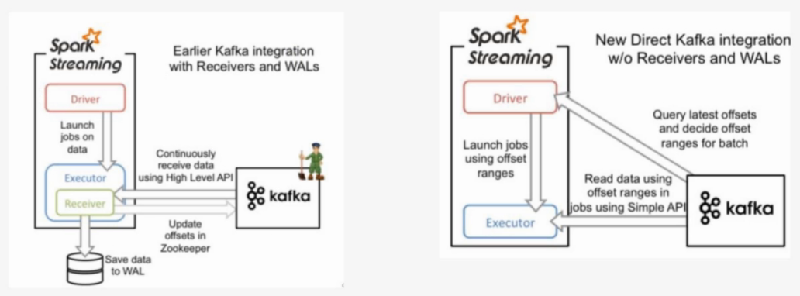

## 4、Spark Streaming对接Kafka

### 4.1 对接数据的两种方式

在前面的案例中，我们监听了来自网络端口的数据，实现了WordCount，但是在实际开发中并不是这样。我们更多的是接收来自高级数据源的数据，例如Kafka。

下面我们来介绍如何利用Spark Streaming对接Kafka



以下两种方式都是为了数据可靠性：

- Receiver-based Approach：由Receiver来对接数据，Receiver接收到数据后会将日志预先写入到hdfs上（WAL），同时也会将数据做副本传输到其他的Worker节点。在读取数据的过程中，Receiver是从Zookeeper中获取数据的偏移信息。
- Direct Approach（No Receivers）：没有Receiver接收信息，由Spark Streaming直接对接Kafka的broker，获取数据和数据的偏移信息。

上述两种方式中，Direct Approach方式更加可靠，不需要Spark Streaming自己去保证维护数据的可靠性，而是由善于处理这类工作的Kafka来做。

**对应代码**

- KafkaUtils.createStream(ssc,zkQuorum,"spark-streaming-consumer",{topic:1})
- KafkaUtils.createDirectStream(ssc,[topic],{"metadata.broker.list":'localhost:9092'})

**Direct API的好处**

- **简化的并行**：在Receiver的方式中我们提到创建多个Receiver之后利用union来合并成一个Dstream的方式提高数据传输并行度。而在Direct方式中，**Kafka中的partition与RDD中的partition是一一对应**的并行读取Kafka数据，这种映射关系也更利于理解和优化。
- **高效**：在Receiver的方式中，为了达到0数据丢失需要将数据存入Write Ahead Log中，这样在Kafka和日志中就保存了两份数据，浪费！而第二种方式不存在这个问题，只要我们Kafka的数据保留时间足够长，我们都能够从Kafka进行数据恢复。
- **精确一次**：在Receiver的方式中，使用的是Kafka的高阶API接口从Zookeeper中获取offset值，这也是传统的从Kafka中读取数据的方式，但由于Spark Streaming消费的数据和Zookeeper中记录的offset不同步，这种方式偶尔会造成数据重复消费。而第二种方式，直接使用了简单的低阶Kafka API，Offsets则利用Spark Streaming的checkpoints进行记录，消除了这种不一致性。

## 4.2 准备工作

**步骤：**

- 配置spark streaming kafka开发环境

  - 1，下载spark streaming集成kafka的jar包

    spark-streaming-kafka-0-8-assembly_2.11-2.3.0.jar

  - 2，将jar包放置到spark的jars目录下

  - 3，编辑spark/conf目录下的spark-defaults.conf，添加如下两条配置

    ```properties
    spark.driver.extraClassPath=$SPAKR_HOME/jars/spark-streaming-kafka-0-8-assembly_2.11-2.3.0.jar
    spark.executor.extraClassPath=$SPARK_HOME/jars/spark-streaming-kafka-0-8-assembly_2.11-2.3.0.jar
    #driver和executor对应的两个路径一致
    ```

- 测试配置是否成功

  - 启动zookeeper

    ```shell
    zkServer.sh start
    ```

  - 启动kafka

    ```shell
    kafka-server-start.sh config/server.properties
    ```

  - 创建topic

    - bin/kafka-topics.sh --create --zookeeper localhost:2181 --replication-factor 1 --partitions 1 --topic test

      replication-factor：副本数量

      partitions：分区数量

      出现Created topic "test"，说明创建成功

  - 查看所有topic

    - bin/kafka-topics.sh --list --zookeeper localhost:2181

  - 通过Pycharm远程连接Centos 创建代码

  - 通过KafkaUtils 成功连接Kafka 创建DStream对象说明连接成功

    ```python
    import os
    # 配置spark driver和pyspark运行时，所使用的python解释器路径
    PYSPARK_PYTHON = "/home/hadoop/miniconda3/envs/datapy365spark23/bin/python"
    JAVA_HOME='/home/hadoop/app/jdk1.8.0_191'
    SPARK_HOME = "/home/hadoop/app/spark-2.3.0-bin-2.6.0-cdh5.7.0"
    # 当存在多个版本时，不指定很可能会导致出错
    os.environ["PYSPARK_PYTHON"] = PYSPARK_PYTHON
    os.environ["PYSPARK_DRIVER_PYTHON"] = PYSPARK_PYTHON
    os.environ['JAVA_HOME']=JAVA_HOME
    os.environ["SPARK_HOME"] = SPARK_HOME
    from pyspark.streaming import StreamingContext
    from pyspark.streaming.kafka import KafkaUtils
    from pyspark.sql.session import SparkSession
    
    sc = sparkContext（'master[2]','kafkastreamingtest'
    ssc = StreamingContext(sc,3)
    #createDirectStream 连接kafka数据源获取数据
    # 参数1 streamingcontext
    #参数2 topic的名字
    # 参数3 kafka broker地址
    ks = KafkaUtils.createDirectStream(ssc,["topic1"],{"metadata.broker.list":"localhost:9092"})
    ```

    

### 4.3 案例实现

需求：利用Spark Streaming不断处理来自Kafka生产者生产的数据，并统计出现的单词数量

- 1，编写producer.py，用于生产数据

  ```python
  from kafka import KafkaProducer
  import time
  
  #创建KafkaProducer，连接broker
  producer = KafkaProducer(bootstrap_servers='localhost:9092')
  
  #每隔一段时间发送一端字符串数据到broker
  def send_data():
      for i in range(60):
          # (key,value) 参数2 是value 
          producer.send('topic_name',"hello,kafka,spark,streaming,kafka")
          time.sleep(2)
  send_data()
  ```

- 2，编辑Spark Streaming代码，统计单词出现的数量

  ```python
  from pyspark.streaming import StreamingContext
  from pyspark.streaming.kafka import KafkaUtils
  from pyspark.sql.session import SparkSession
  
  topic="topic_name"
  
  spark = SparkSession.builder.master("local[2]").getOrCreate()
  sc = spark.sparkContext
  ssc = StreamingContext(sc,3)
  
  #创建direct连接，指定要连接的topic和broker地址
  ks = KafkaUtils.createDirectStream(ssc,[topic],{"metadata.broker.list":"localhost:9092"})
  #(None,内容)
  ks.pprint()
  #（key,value)
  #以下代码每操作一次，就打印输出一次
  lines = ks.map(lambda x:x[1])
  lines.pprint()
  
  words = lines.flatMap(lambda line:line.split(","))
  #words.pprint()
  
  pairs = words.map(lambda word:(word,1))
  #pairs.pprint()
  
  counts = pairs.reduceByKey(lambda x,y:x+y)
  counts.pprint()
  
  ssc.start()
  #等待计算结束
  ssc.awaitTermination()
  ```

- 3，开启Spark Streaming消费数据，将产生的日志结果存储到日志中

  spark-submit xxx.py>a.log

- 4，开启producer.py，生产数据

  python3 producer.py

- 5，通过浏览器观察运算过程

  http://node-teach:4040

- 6，分析生成的日志内容

  ```
  -------------------------------------------
  Time: 2018-12-11 01:31:21
  -------------------------------------------
  (None, 'hello,kafka,spark,streaming,kafka')
  (None, 'hello,kafka,spark,streaming,kafka')
  (None, 'hello,kafka,spark,streaming,kafka')
  (None, 'hello,kafka,spark,streaming,kafka')
  
  -------------------------------------------
  Time: 2018-12-11 01:02:33
  -------------------------------------------
  hello,kafka,spark,streaming,kafka
  hello,kafka,spark,streaming,kafka
  
  -------------------------------------------
  Time: 2018-12-11 01:02:33
  -------------------------------------------
  hello
  kafka
  spark
  streaming
  kafka
  hello
  kafka
  spark
  streaming
  kafka
  
  -------------------------------------------
  Time: 2018-12-11 01:02:33
  -------------------------------------------
  ('hello', 1)
  ('kafka', 1)
  ('spark', 1)
  ('streaming', 1)
  ('kafka', 1)
  ('hello', 1)
  ('kafka', 1)
  ('spark', 1)
  ('streaming', 1)
  ('kafka', 1)
  
  -------------------------------------------
  Time: 2018-12-11 01:02:33
  -------------------------------------------
  ('streaming', 2)
  ('hello', 2)
  ('kafka', 4)
  ('spark', 2)
  
  -------------------------------------------
  Time: 2018-12-11 01:02:36
  -------------------------------------------
  
  -------------------------------------------
  Time: 2018-12-11 01:02:36
  -------------------------------------------
  ```

